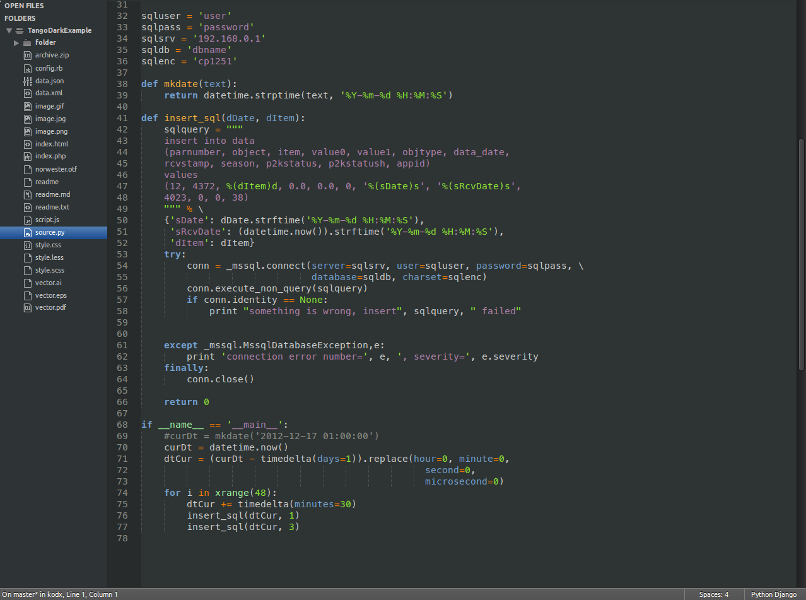
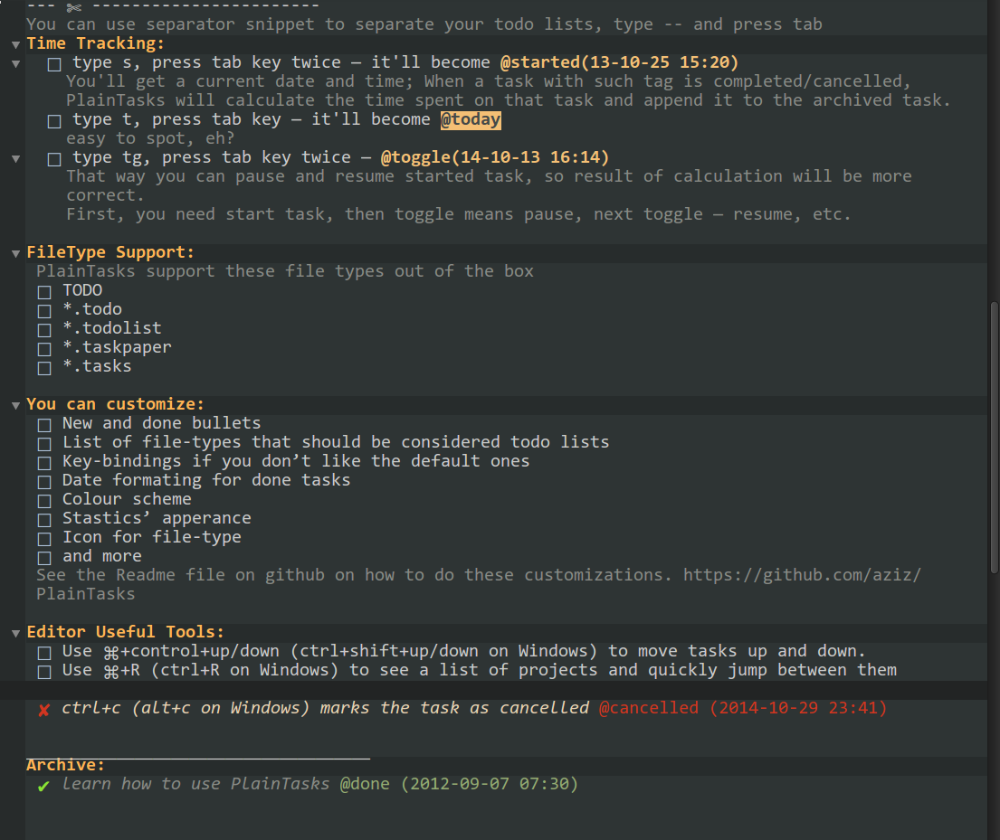
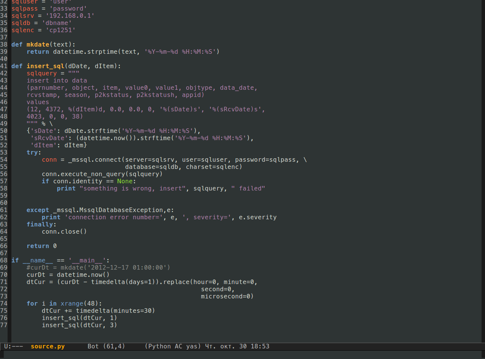

# [TangoDark](https://github.com/kodx/tangodark).
### A dark interface and syntax theme for [Sublime Text 3](http://www.sublimetext.com/3) and [Emacs](http://www.gnu.org/software/emacs)

## About

TangoDark is a dark theme and a syntax color scheme based on [Tango Style Theme Guidelines](http://tango.freedesktop.org/Tango_Icon_Theme_Guidelines).

Filetype icons  from [Predawn Theme](https://github.com/jamiewilson/predawn).  
Folder icons from [Soda Theme by Ian Hill](http://buymeasoda.com/).  

## Activating the Theme for Sublime Text 3

Open your user settings file `preferences.sublime-settings` and add or replace your current theme settings with the code below:

```json
{
    "theme": "TangoDark.sublime-theme",
    "color_scheme": "Packages/TangoDark/TangoDark.tmTheme",
}
```



_Note: File icons are supported only for **Beta BUILDS 3065+**._

## TangoDark PlainTasks color scheme

TangoDark theme supplied with [PlainTasks](https://github.com/aziz/PlainTasks) color scheme:



To activate open `PlainTasks.sublime-settings` and add or replace "color_scheme" option with:

```json
{
    "color_scheme": "Packages/TangoDark/TangoDark-PlainTasks.tmTheme",
}
```

## Activating the theme for Emacs

Add to your Emacs config:

```lisp
(add-to-list 'custom-theme-load-path "~/.emacs.d/themes/TangoDark")
(load-theme 'tangodark t)
```



## License

TangoDark Theme is licensed under the [Creative Commons Attribution-ShareAlike 3.0 License](http://creativecommons.org/licenses/by-sa/3.0/). You are free to share and remix the theme, however please abide by the license terms when doing so.

The following details apply to the Creative Commons license "author specified" components:

* Attribution example: Based on TangoDark Theme by Yegor Bayev (https://github.com/kodx/tangodark)

* Naming guidelines: If you create and distribute a derivative theme, please give your theme a unique and original name that does not directly include "TangoDark Theme" (or a close variant) in the main project title, repo name or a Package Control name.
